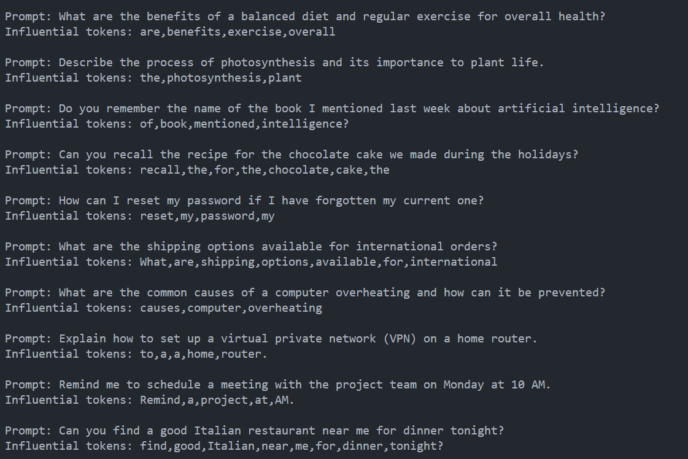
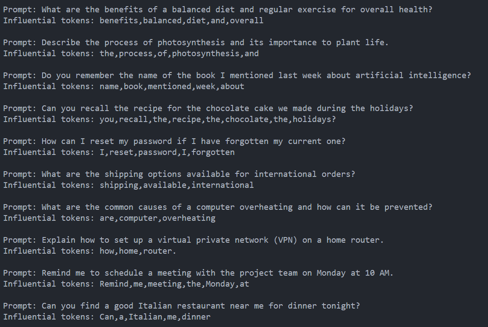

# Attention-based retrieval system (proof-of-concept)

#### By Habibullah Akbar

This work showcasing the emerge ability of Transformer model to extract the most "important" information inside its attention layer. Ideally, we should extract attention layer directly from inference process to get the most influential token inside a sequence. But with this work, we do something clever and different.

We generate a variants of input in loop, replacing each word/token one-by-one to find the most influencial token. We compare each variants with the base variant, implying that the most far distance similarity is the most influencial token.

This is just a simple implementation using Groq API and Google Gemini Text embedding. The full implementation should modify the inference code.

## Example

(Above: Llama-3-70b via Groq API extraction results given 10 examples)

---

(Above: Llama-3-8b via Groq API extraction results given 10 examples)